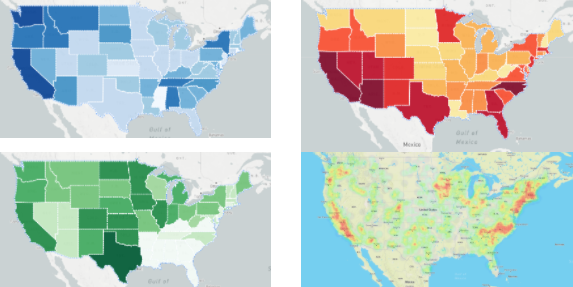
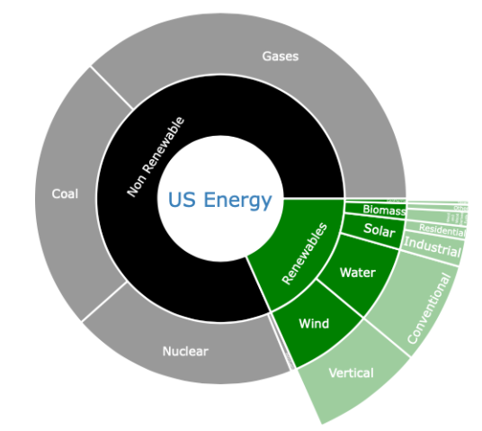
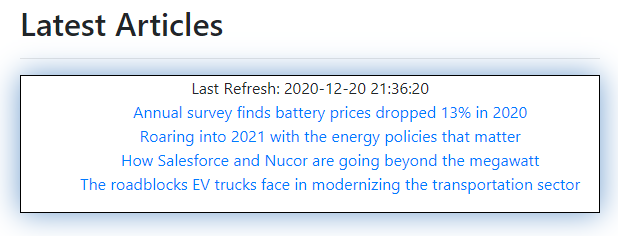

# Renewable Energy Production

# Project deployed on AWS at http://18.189.31.33:5000

## Introduction

The objective of this project was to find particular data on a topic of interest and to use different web development software to create a variety of visualizations that will tell a story through using data in our database on Renewable Energy Resource Production in the US. We also created a webscraping function that gives you the latest news in regards to renewable energy.

## Programs used: 
Javascript\
HTML\
Pandas\
Jupyter Notebook\
Mongo\
SQLite\
Python\
Mapbox\
Leaflet.

## Visualizations made: 
Heatmap\
Choropleth Maps\
Sunburst

## Additional Components
Webscraping

## Data Sources: 
https://www.energy.gov/science-innovation \
https://www.eia.gov/electricity/data/browser/#/topic/0?agg=1,0,2&fuel=004&geo=qnifi05c03j78&sec=o3g&linechart=ELEC.GEN.SUN-US-99.M~ELEC.GEN.SUN-NV-99.M~ELEC.GEN.SUN-CA-99.M&columnchart=ELEC.GEN.SUN-US-99.M~ELEC.GEN.SUN-NV-99.M~ELEC.GEN.SUN-CA-99.M&map=ELEC.GEN.SUN-US-99.M&freq=M&start=200101&end=202007&ctype=linechart&ltype=sourcekey&rtype=s&maptype=0&rse=0&pin=\
https://www.sciencedaily.com/news/earth_climate/renewable_energy.

## Requirements to run the app on the local machine
download entire folder\
Run app.py\
Access at local host http://127.0.0.1:5000/

